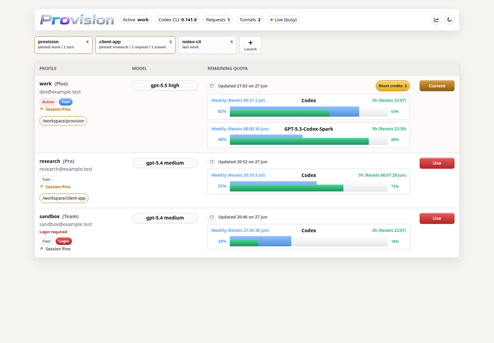
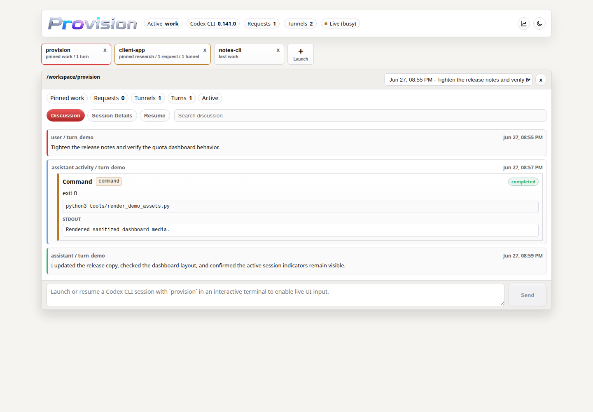
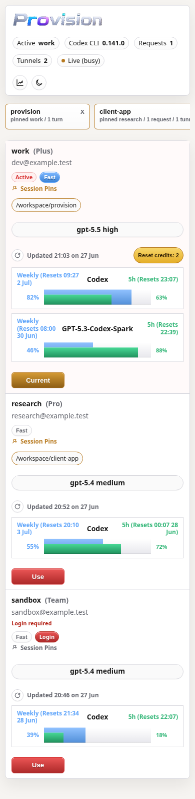

<p align="center">
  
</p>

Provision is a Linux-native control plane and account manager for Codex CLI.
Run `provision` instead of `codex` to keep Codex CLI's normal terminal workflow,
resume history, and built-in login flow while adding a local browser dashboard
for sessions, launch/resume, live terminal-backed interaction, quotas, reset
credits, usage stats, and account-aware routing.

Provision is useful even when you only use one account: it gives Codex CLI a
localhost dashboard for active sessions, live turns, terminal-backed input,
quota/reset timing, reset-credit visibility, and usage trends. With multiple
accounts, it adds named ChatGPT login profiles, safe profile switching, and
session pins so one Codex CLI workspace can stay tied to an account while
another workspace uses a different profile.

The current implementation targets Codex CLI with ChatGPT login profiles. It is
not a desktop Codex client or a hosted multi-user service.

The earlier cross-CLI credential research is still available in
[docs/cli-credential-isolation.md](docs/cli-credential-isolation.md).

## Requirements

- Codex CLI `0.141.0` or newer is the current validation target for the full
  dashboard, model picker, quota, and compatibility-reporting path.
- Python 3.11+ is recommended.
- The richest quota display depends on Codex CLI and the ChatGPT backend
  reporting multi-bucket usage data. Older Codex CLI versions may still route
  model traffic through Provision through fallback behavior, but model metadata,
  status labeling, or extra quota buckets may be incomplete.

## Quick Start

From this repo:

```bash
./bin/provision import-default
./bin/provision login <profile_name> [--device-auth]
./bin/provision profiles
./bin/provision doctor
./bin/provision ui
./bin/provision
```

For example:

```bash
./bin/provision login work --device-auth
./bin/provision use work
./bin/provision resume --last
```

Open `provision ui` for the dashboard. The `+` tab can launch Codex CLI in an
observed workdir, choose a permission preset, or resume a known session while
keeping Codex CLI's native transcript history.

For normal command usage, put `bin/provision` on PATH or install editable:

```bash
python3 -m pip install -e .
```

Arguments that are not Provision commands pass through to Codex CLI. Model
commands receive the proxy config in the position Codex CLI expects:

```bash
provision
provision resume --last
provision debug models
provision exec "Say hello"
```

Help is available from the top level and from subcommands:

```bash
provision --help
provision help
provision login --help
```

## What Provision Adds

- Named Codex CLI ChatGPT login profiles captured through isolated temporary
  `CODEX_HOME` directories.
- A localhost Codex CLI control plane with session tabs, launcher/resume
  controls, discussion view, session details, live compose, and observed tool
  activity.
- PTY-backed UI interaction for Provision-managed launchers, so dashboard input
  is sent to the running Codex CLI terminal rather than forking an unrelated
  app-server thread.
- A profile/account dashboard with active request counts, WebSocket tunnel
  state, observed working directories, session pins, and quota bars.
- Session-aware switching: unpinned Codex CLI activity blocks account changes,
  while pinned sessions can remain active without blocking switches for other
  sessions.
- Per-profile quota caching, manual refresh, automatic hourly refresh, and
  refreshes shortly after detected quota reset times.
- Rate-limit reset credit visibility and confirmation-gated redemption for
  supported Codex CLI app-server builds.
- Usage stats with profile-level request, tunnel, traffic, token, fast-mode,
  quota movement, and reset-credit activity.
- Timestamped `/status` quota labels so Codex CLI can show which Provision
  profile supplied the displayed quota.
- Codex CLI compatibility reporting in `provision status`, `provision doctor`,
  and the dashboard header, including the installed Codex CLI version and
  bundled model catalog source.
- Codex CLI app-server capability probing for account usage, reset credits, and
  future native app-server control-plane work.
- Resume-compatible launching that keeps Codex CLI's native transcript history
  and `model_provider=openai` session identity intact.

## How It Works

Provision starts a local daemon when needed, points Codex CLI's built-in
`openai` provider at that daemon, and passes a local `OPENAI_PROJECT` sentinel
to identify the calling working directory. The daemon removes that sentinel
before forwarding upstream and injects the selected Provision profile's real
credentials.

When Codex CLI is launched through Provision, the launcher also maintains a
local PTY bridge. The browser dashboard can use that bridge to show Codex CLI
activity and send input to the same terminal session, preserving one
conversation instead of creating a separate app-server thread.

This keeps Codex CLI-compatible behavior intact:

- `codex resume` and `provision resume` see the same local transcripts.
- Codex CLI continues to record sessions as `model_provider=openai`, avoiding
  resume-picker fragmentation between stock Codex CLI and Provision runs.
- Responses WebSocket traffic is tunneled through Provision; HTTP and backend
  usage requests are proxied through the same account-selection layer.
- Profile switches are refused while unpinned upstream work is active, with a
  short idle grace period before switching becomes available.
- Dashboard control works for Provision-managed launchers. Stock Codex CLI
  sessions may still be visible through proxy observations, but they do not have
  the same live PTY input channel.

## Profiles

Import the current stock Codex CLI login as the `default` Provision profile:

```bash
provision import-default
```

Rerunning `import-default` leaves an existing profile unchanged. Use
`--overwrite` only when you intentionally want to replace the stored profile
from the current stock Codex CLI `~/.codex/auth.json`.

Capture additional ChatGPT login profiles without using Codex CLI `/logout`:

```bash
provision login work --device-auth
provision login personal
```

The dashboard can also start a browser or device-code login for profiles that
need fresh credentials. Browser login must complete in a browser running where
the Provision daemon can receive `localhost` redirects. Use device auth when
the dashboard is reached through a VM, SSH tunnel, port forward, or other remote
boundary. Running dashboard login attempts can be canceled from the same Login
menu.

If an upstream refresh token is stale or already consumed, Provision marks the
profile as needing login, records the refresh failure, and shows an auth-health
notice in the dashboard. A successful login clears the stale-login state.

Switch profiles from the CLI or dashboard:

```bash
provision profiles
provision use work
provision ui
```

## Dashboard

Open the dashboard URL with:

```bash
provision ui
```

The dashboard is localhost-only and shows:

- Active profile, active requests, active tunnels, and live idle/busy state.
- Provision-managed Codex CLI sessions as tabs, including observed titles,
  workdirs, active turn state, and session details.
- A `+` launcher for starting Codex CLI in known workdirs, selecting permission
  presets, and choosing recent sessions to resume.
- A Discussion view with Markdown rendering, searchable transcript content,
  tool-call activity, and a terminal-backed compose box for live interaction.
- All enrolled profiles and their last-known quota.
- Stacked quota bars for short-window and weekly limits, including reset times.
- Available rate-limit reset credits, with a confirmation prompt before one is
  consumed.
- Extra quota buckets when the upstream account reports them.
- Observed Codex CLI working directories and session pins.
- Usage stats with profile filters, a trend graph, profile totals, and a recent
  activity feed.
- Light/dark mode following the system preference, with a manual toggle.
- The installed Codex CLI version and live compatibility state observed by
  Provision.

If the daemon restarts while the page is open, the page reloads so local
development and daemon upgrades do not leave stale UI code running in-place.

## Demo

These screenshots use sanitized fixture data generated by
`tools/render_demo_assets.py`.

Profile, model, quota, reset-credit, and session overview:

<p align="center">
  <picture>
    <source media="(prefers-color-scheme: dark)" srcset="docs/media/provision-dashboard-desktop-dark.png">
    
  </picture>
</p>

Session control plane with observed turns, tool activity, resume controls, and
terminal-backed compose:

<p align="center">
  
</p>

<p align="center">
  
</p>

[Theme toggle demo video](docs/media/provision-dashboard-theme-toggle.mp4)

## Session Pins

Provision observes Codex CLI working directories when launched through
`provision`. A working directory can be pinned to a profile from the dashboard.

Pinned sessions are useful when you want one project to keep using a specific
account while other projects switch accounts. Active pinned sessions still show
in the dashboard's Requests, Tunnels, and Live indicators, but they do not block
switching for unpinned sessions.

Pins persist in Provision state. The observed session list itself is not
persisted; working directories reappear after Provision observes them again.

## Status And Quota

Codex CLI `/status` receives usage data for the active Provision profile.
Provision labels the quota section with a timestamp such as:

```text
Provision (work - updated 15:36 on 22 May)
```

When the active profile is not `default`, Provision can also append the stored
Provision `default` profile's quota as separate non-`codex` status rows. This is
the stored Provision profile named `default`; it is not necessarily the account
currently logged in through stock Codex CLI.

Quota is cached per profile. Provision refreshes politely:

- At most one upstream usage refresh per second across the daemon.
- At least once per hour per account, based on that account's last successful
  update.
- One minute after detected reset times, unless a newer refresh already happened.
- Opportunistically from WebSocket quota events and relevant response headers.
- Opportunistically from Codex CLI app-server rate-limit data when available;
  this app-server enrichment is cached, throttled, and background-only so it
  does not block the primary quota path.

`provision status` prints JSON that includes the active profile, daemon state,
profile list, dashboard URL, and Codex CLI compatibility payload. `provision
doctor` presents the same Codex CLI version and bundled model-catalog readiness
as local checks.

## Ports

The daemon prefers stable localhost port `4888`. If that port is unavailable,
Provision falls back to a dynamic port and records the selected port in
`~/.provision/daemon.json`.

Choose a specific port with `PROVISION_PORT` or explicit daemon startup:

```bash
PROVISION_PORT=4888 provision
provision start --port 4888
provision ui --port 4888
```

## Storage

Provision state is outside the repo:

```text
~/.provision/
  proxy-token
  daemon.json
  daemon.log
  codex/
    active-profile
    reset-credit-events.jsonl
    session-pins.json
    profiles/<name>/
      auth.json
      metadata.json
```

These files include credentials. Do not commit or sync them casually.

## Common Commands

| Command | Purpose |
| --- | --- |
| `provision` | Launch Codex CLI through the active Provision profile. |
| `provision resume [--last\|--all] [Codex CLI args...]` | Resume Codex CLI through Provision while preserving native Codex CLI transcript history. |
| `provision exec "prompt"` | Run Codex CLI non-interactively through the active Provision profile. |
| `provision import-default [--name <profile_name>] [--overwrite]` | Import the current stock Codex CLI `~/.codex/auth.json` as a Provision profile. Defaults to `default`; existing profiles are left unchanged unless `--overwrite` is set. |
| `provision login <profile_name> [--device-auth]` | Capture a new Codex CLI ChatGPT login into an isolated Provision profile. |
| `provision profiles` | List enrolled profiles and show which one is active. |
| `provision use <profile_name>` | Switch the active profile when unpinned proxy work is idle. |
| `provision ui [--port <port>]` | Start the daemon if needed and print the localhost dashboard URL for profiles, sessions, quota, stats, and launch/resume controls. |
| `provision status` | Print JSON status for Provision home, Codex CLI compatibility, daemon, active profile, profiles, and dashboard URL. |
| `provision app-server-probe [--read-account]` | Inspect the installed Codex CLI app-server schema, including usage, reset-credit, and control-plane readiness; with `--read-account`, start a short-lived Codex app-server and read account usage/rate-limit data for the current Codex CLI login. |
| `provision start [--port <port>]` | Start the local proxy daemon without launching Codex CLI. |
| `provision stop` | Stop the running daemon. |
| `provision doctor` | Run local environment and Codex CLI compatibility checks. |
| `provision --help`, `provision <command> --help` | Show top-level or command-specific help. |

## Verification

Recommended local checks:

| Command | Checks |
| --- | --- |
| `PYTHONPATH=src python3 -m unittest discover -s tests` | Unit and regression coverage for storage, proxy rewriting, dashboard rendering, quota parsing, login lifecycle, and app-server resilience. |
| `PYTHONPATH=src python3 -m compileall -q src tests` | Python syntax/import compile pass. |
| `PYTHONPATH=src ./bin/provision app-server-probe` | Installed Codex CLI app-server schema compatibility. |
| `PYTHONPATH=src ./bin/provision status` | Provision home, daemon, profile, dashboard URL, and Codex CLI compatibility payload. |
| `provision exec --ephemeral -s read-only -c 'approval_policy="never"' 'Reply with exactly: provision-ok'` | End-to-end Codex CLI launch through Provision against the active profile. |

The `exec` banner should report `provider: openai`, and the active Provision
profile should be the account that answers upstream.

## Troubleshooting

If you are developing or upgrading Provision from source, restart the daemon
before expecting daemon-side changes to take effect:

```bash
provision stop
provision start
```

- If the dashboard is open during a daemon restart, it reloads itself after the
  new daemon comes up.
- If browser login is started from a dashboard reached through a VM, SSH tunnel,
  or port forward, the provider redirect may not reach the daemon's localhost
  listener. Use Device Auth, or complete browser login in the environment where
  the daemon is running. A stuck browser-login attempt can be canceled from the
  Login menu.
- If a profile reports that login is required because a refresh token is stale
  or already consumed, run `provision login <profile_name> --device-auth` or use
  the dashboard Login menu. A successful login clears the recorded auth-health
  warning.
- If a profile reports billing or workspace deactivation, Provision keeps the
  profile visible but slows automatic refresh attempts and blocks switching to
  that profile until the upstream account issue is resolved.
- App-server data is optional. If `provision app-server-probe` reports missing
  methods or app-server reads fail, Provision still routes Codex CLI traffic and
  uses the primary ChatGPT backend usage path.

## Security

Provision stores and forwards local CLI credentials. Do not open a public issue
for credential leaks, token exposure, authentication bypasses, or proxy
isolation issues. See [SECURITY.md](SECURITY.md).

## Limitations

- Provision targets Codex CLI. It does not currently manage desktop Codex apps.
- The dashboard is localhost-only. It is intended for a single local user, not a
  remote multi-user control plane.
- Live dashboard input depends on launching Codex CLI through Provision's PTY
  bridge. Sessions that are only observed through proxy traffic can appear in
  the dashboard, but may not be controllable from the browser.
- Provision keeps Codex CLI's built-in `openai` provider identity for resume
  compatibility. Native Codex CLI account identity can therefore reflect the
  stock `~/.codex/auth.json`; Provision status labels, `provision status`, and
  `~/.provision/daemon.log` show the profile actually used by the proxy.
- Quota sections are shaped from upstream usage payloads. If a profile or plan
  does not report a bucket, Provision does not invent one.
- Turn/activity tracking is based on Provision's PTY bridge, proxy observations,
  and recognized Codex CLI traffic shapes. Codex CLI app-server control-plane
  surfaces are probed but remain optional.
- Codex CLI still applies its normal current-working-directory filter in the
  resume picker. Use `provision resume --all` when launching from a different
  directory than the sessions you want to see.

## Roadmap

- First-class API-key profile enrollment, so users can store and switch named
  OpenAI API keys without relying on shell-level `OPENAI_API_KEY` changes.
- API-key-aware dashboard and status output when ChatGPT subscription quota does
  not apply.
- API billing and rate-limit visibility for API-key profiles if suitable
  upstream billing, usage, or limits endpoints can be integrated cleanly.
- Optional policy controls such as workspace defaults, spend guardrails, audit
  logs, and key rotation metadata.
- A Provision-native app-server UI mode for users who intentionally want a
  browser-first workflow separate from the Codex CLI terminal.
- Deeper Codex CLI app-server integration for richer thread/turn state, token
  usage, login orchestration, model metadata, and possibly cleaner
  `chatgptAuthTokens`-style credential injection if that upstream surface
  becomes stable enough for third-party use.
  See
  [docs/codex-app-server-integration.md](docs/codex-app-server-integration.md).

## License

Provision is licensed under the Apache License 2.0. See [LICENSE](LICENSE).
