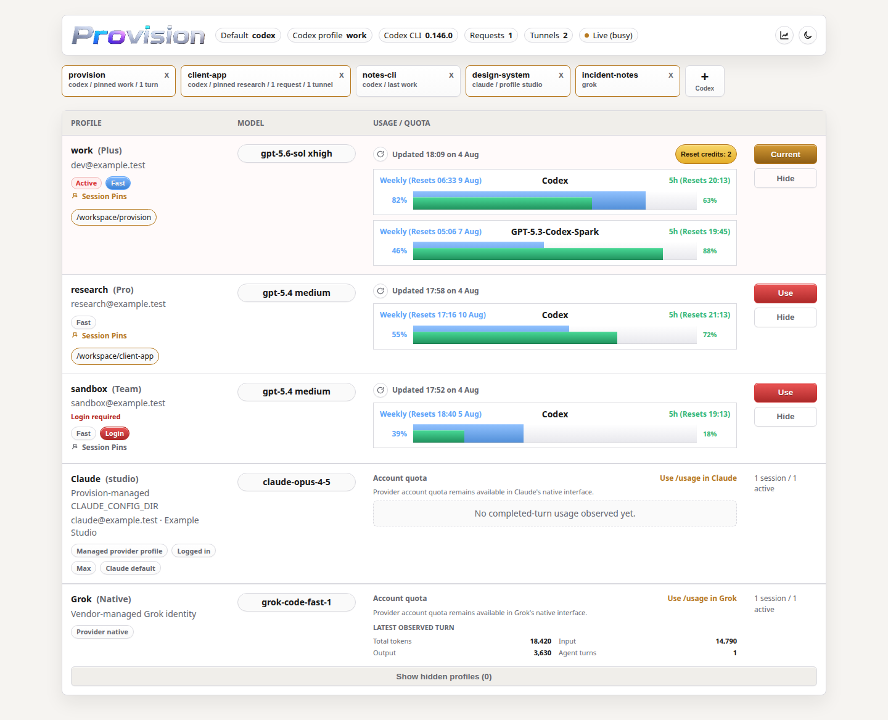
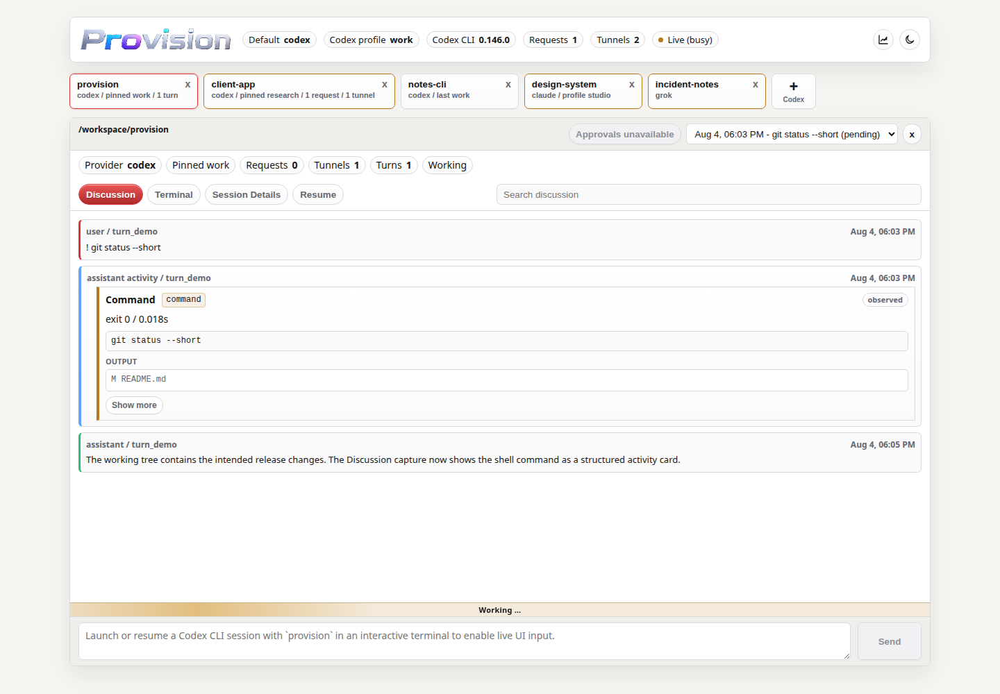
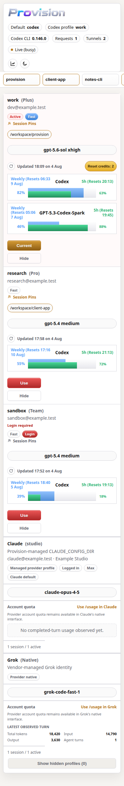

<p align="center">
  
</p>

Provision is a Linux-native, local-first control plane for supported AI coding
CLIs. Codex CLI is the default and has the richest integration: named ChatGPT
profiles, account-aware proxy routing, native history, quotas, reset credits,
and usage stats. Claude Code and Grok Build can also run through Provision's
managed PTY path, preserving their native terminal workflow while adding local
session visibility, dashboard input, and an on-demand terminal view. Their
provider-owned local conversation logs also supply bounded Discussion messages,
tool activity, session identity, model metadata, and working state. Grok's
stream additionally supplies structured completed-turn usage.

Provision is useful even when you only use one account: it gives Codex CLI a
localhost dashboard for active sessions, live turns, terminal-backed input,
quota/reset timing, reset-credit visibility, and usage trends. With multiple
accounts, it adds named ChatGPT login profiles, safe profile switching, and
session pins so one Codex CLI workspace can stay tied to an account while
another workspace uses a different profile.

Provision does not currently proxy Claude or Grok traffic or copy their credentials.
Those clients keep their native authentication and upstream connections.
Provision follows their provider-owned local session logs through bounded,
read-only adapters; the native terminals remain authoritative. Where a vendor
does not publish a compatible model, quota, or control interface, Provision
labels that information unavailable rather than fabricating it. Grok's
structured completed-turn usage is shown separately from its account quota,
which remains available only through Grok's conditional native `/usage`
command. It is not a desktop client or a hosted multi-user service.

The earlier cross-CLI credential investigation is still available in
[docs/cli-credential-isolation.md](docs/cli-credential-isolation.md).
For a compact architecture and trust-boundary overview, see
[Provision concepts](docs/concepts.md).

## Install

Provision is not currently published on PyPI. Install the current release from
the versioned GitHub source with `pipx` (recommended for an isolated CLI):

```bash
pipx install "git+https://github.com/jeremydixon22/provision.git@Provision-v0.7.1"
provision-codex doctor
```

Both `provision` and the collision-resistant `provision-codex` alias invoke the
same CLI. Contributors can instead clone the repository and run
`python3 -m pip install -e ".[dev]"`. Do not install an unrelated package named
`provision` from PyPI expecting this project.

## Demo

These screenshots use sanitized fixture data generated by
`tools/render_demo_assets.py`.

Profile, model, quota, reset-credit, and session overview. The fixture shows
Codex, Claude, and Grok sessions; the active Codex profile uses `gpt-5.6-sol`
with `xhigh` reasoning:

<p align="center">
  <picture>
    <source media="(prefers-color-scheme: dark)" srcset="docs/media/provision-dashboard-desktop-dark.png">
    
  </picture>
</p>

Session control plane with observed turns, tool activity, resume controls, and
terminal-backed compose:

<p align="center">
  
</p>

Discussion keeps messages compact and shows Codex shell-command activity with
its command, exit status, duration, and output:

<p align="center">
  
</p>

<p align="center">
  
</p>

[Discussion walkthrough](docs/media/provision-discussion-demo.mp4) · [Theme toggle demo](docs/media/provision-dashboard-theme-toggle.mp4)

## Requirements

- Codex CLI `0.144.0` or newer is required for Codex's full dashboard,
  GPT-5.6 model picker, quota, and compatibility-reporting path.
- Claude Code and Grok Build are optional local clients. Provision detects
  them on `PATH`; they retain their vendor-native login and network behavior.
- The current bundled catalog includes GPT-5.6-Sol, GPT-5.6-Terra, and
  GPT-5.6-Luna.
- Python 3.11+ is recommended.
- The richest quota display depends on Codex CLI and the ChatGPT backend
  reporting multi-bucket usage data. Older Codex CLI versions may still route
  model traffic through Provision through fallback behavior, but model metadata,
  status labeling, or extra quota buckets may be incomplete.

## Quick Start

From this repo:

```bash
./bin/provision import-default
./bin/provision login <profile_name> [--device-auth]
./bin/provision profiles
./bin/provision doctor
./bin/provision ui
./bin/provision
```

For example:

```bash
./bin/provision login work --device-auth
./bin/provision use work
./bin/provision resume --last
```

Open `provision ui` for the dashboard, or use `provision ui --open` to also open
it in the default browser. The `+` tab can launch Codex CLI in an observed
workdir, choose a permission preset, or resume a known session while keeping
Codex CLI's native transcript history.

For normal command usage from a checkout, put `bin/provision` on PATH or install
editable:

```bash
python3 -m pip install -e .
```

With the default provider still set to Codex, arguments that are not Provision
commands pass through to Codex CLI. Model commands receive the proxy config in
the position Codex CLI expects:

```bash
provision
provision resume --last
provision debug models
provision exec "Say hello"
```

Choose another installed provider explicitly, with case-insensitive names, or
make it the default for bare and unqualified `provision` invocations:

```bash
provision providers
provision GroK
provision claude
provision provider use grok
provision                    # now launches Grok Build
provision provider use codex # restore the default
```

Claude and Grok can use isolated, vendor-native profile roots without copying
or interpreting their credentials. Complete the vendor's own login inside the
selected root, then launch with it:

```bash
provision provider login grok work
provision grok --provision-profile work
provision provider login claude work
provision Claude --provision-profile work
```

`--provision-profile` is consumed by Provision and is not passed to the vendor
CLI. It selects only a documented vendor profile-root environment for the new
process. Codex continues to use `provision import-default`, `provision login`,
and `provision use` for its separate proxied ChatGPT profiles.

Grok's full-screen TUI remains native. If a scrollback-oriented terminal tail
is preferable, use Grok's own `--minimal` or `--no-alt-screen` option; Provision
does not add or alter either option.

Help is available from the top level and from subcommands:

```bash
provision --help
provision help
provision login --help
```

## What’s New In 0.7.1

- Renders live compact quota readouts and profile rows from structured payloads,
  preserving dashboard behavior without inserting server-provided HTML into the
  page.
- Makes Codex compatibility diagnostics fully self-contained in CI environments
  that do not have the Codex CLI installed.

## What’s New In 0.7.0

- Provider-aware launches and managed PTYs for Claude Code and Grok Build,
  alongside Codex's account-aware routing and quota integration.
- Bounded Claude and Grok Discussion activity, including messages, tools,
  models, session identity, working state, and Grok completed-turn usage.
- Claude and Grok identity rows in the Profiles pane, with native-provider
  authentication and quota status presented separately from Codex accounts.
- Browser permission handling for supported managed Claude sessions, with
  terminal, timeout, and disconnect fallbacks.
- An on-demand, bounded Terminal view for managed PTY sessions.
- Mobile Discussion and Focus discussion layouts that keep the transcript and
  composer usable around sticky controls and software keyboards.
- Active-turn working indicators and live-transcript reconciliation that retain
  final closeouts after long-running work.
- More resilient tool and Markdown rendering for patches, shell commands,
  compaction packets, provider tools, file references, acronyms, links, tables,
  and streamed boundaries.
- Reset-credit inspection and selection, plus active-profile support for Codex
  web search and image generation/editing endpoints.
- Same-user Connector controls for host-local enrollment, capability grants,
  revocation, and idempotent actions.
- Loopback deployment hardening, bounded log rotation, modular daemon
  boundaries, and expanded validation coverage.

## What’s New In 0.6.0

- Bounds each session's live Discussion snapshot and loads older observed turns
  only when requested, keeping busy multi-session dashboards responsive while
  retaining a clear path back through prior discussion.
- Fully collapses context-compaction packets behind an explicit **Show
  post-compaction packet** control, keeping routine Discussion views focused.
- Makes mobile Discussion, Focus discussion, and composer interaction use the
  visual viewport so the active transcript and send controls remain reachable
  above a mobile keyboard.
- Improves Discussion Markdown handling for streamed content, local file
  references, parenthesized links, fenced code, and tables with escaped or
  inline-code pipes.
- Recognizes patch-shaped tool calls more accurately and shows a compact patch
  preview with file and line-change metadata before expansion.
- Routes both direct image creation and image edits, including multipart edit
  uploads, through the active Provision profile.
- Adds a per-profile **Hide** control to declutter the dashboard without
  changing an account's active status or routing eligibility; hidden profiles
  can be revealed from the bottom of the list.
- Updates GPT-5.6 context accounting to its 272,000-token context window.
- Keeps the dormant Remote Agent groundwork inert during normal local use: no
  remote socket, token, or remote state is created until a future agent path is
  explicitly activated.
- Adds an experimental generic Connector ABI for trusted local connector
  processes. It carries bounded, named frames over user-supplied local, direct,
  or relay transports without bundling a network listener or cryptography.

## What’s New In 0.5.0

- Treats Codex CLI `!` shell commands as structured Discussion activity, with
  the command, exit code, duration, and output shown as a readable command
  card in both live sessions and recovered native history.
- Makes OpenAI's temporary weekly-only quota state explicit: the Weekly quota
  remains in its normal position while the unavailable five-hour horizon is
  labeled `N/A` / `Not enforced`.
- Keeps the package metadata and model-catalog documentation current for the
  supported GPT-5.6 Codex variants.
- Refreshes the sanitized dashboard media and adds a focused Discussion demo.

## What’s New In 0.4.0

- Keeps a busy dashboard responsive by sending incremental live-state updates
  and loading native Codex history and resume candidates only when requested.
- Shows native Codex history beside live observations without duplicating turns
  that Provision has already captured.
- Routes direct image-generation requests and shows a concise completion entry
  in Discussion after an image is created.
- Reads each profile's available models from Codex CLI's app-server surface in
  the background, while preserving the bundled catalog as a safe fallback.
- Runs Codex commands that bypass Provision's HTTP provider path with the
  active profile's credentials, without replacing the user's normal Codex
  configuration or session history.
- Warns when the installed Codex CLI changes underneath the daemon, so an
  upgrade can be completed with a daemon restart after active work finishes.

## What Provision Adds

- A provider registry with case-insensitive direct launch (`provision grok`,
  `provision Claude`, `provision CODEX`) and a persisted default for bare or
  unqualified invocations.
- Provision-managed native PTY sessions for supported local CLIs, with browser
  input delivered to the same terminal and an on-demand, bounded plain-text
  terminal tail for seeing active native work.
- A bounded Grok session adapter that follows its documented append-only update
  stream for live Discussion messages, reasoning activity, tool calls, model
  metadata, turn lifecycle, and completed-turn token/call/cost usage without
  scraping the full-screen TUI.
- A bounded Claude session adapter that incrementally follows the active native
  project conversation log for prompts, assistant messages, tool activity,
  generated titles, model identity, compaction boundaries, and working state.
- A shared, queued permission modal with bounded request previews, one-time
  allow/deny decisions, and explicit fallback to the native terminal. Browser
  approval is opt-in per session and is currently available for newly launched
  managed Claude sessions that do not supply their own settings overlay.
- Named Codex CLI ChatGPT login profiles captured through isolated temporary
  `CODEX_HOME` directories.
- A localhost Codex CLI control plane with session tabs, launcher/resume
  controls, discussion view, session details, live compose, and observed tool
  activity.
- Incremental dashboard updates plus on-demand native-history and resume data,
  keeping the control plane responsive as the number of managed sessions grows.
- PTY-backed UI interaction for Provision-managed launchers, so dashboard input
  is sent to the running Codex CLI terminal rather than forking an unrelated
  app-server thread.
- A profile/account dashboard with active request counts, WebSocket tunnel
  state, observed working directories, session pins, and quota bars.
- Distinct Claude and Grok provider-identity rows for observed native sessions
  and named `CLAUDE_CONFIG_DIR` or `GROK_HOME` roots. These keep provider
  identity, session/model activity, and vendor account quota visibly separate
  from Codex account routing.
- Session-aware switching: unpinned Codex CLI activity blocks account changes,
  while pinned sessions can remain active without blocking switches for other
  sessions.
- Per-profile quota caching, manual refresh, automatic hourly refresh, and
  refreshes shortly after detected quota reset times.
- Rate-limit reset credit visibility and confirmation-gated redemption for
  supported Codex CLI app-server builds.
- Usage stats with profile-level request, tunnel, traffic, token, fast-mode,
  quota movement, and reset-credit activity.
- Timestamped `/status` quota labels so Codex CLI can show which Provision
  profile supplied the displayed quota.
- Codex CLI compatibility reporting in `provision status`, `provision doctor`,
  and the dashboard header, including the installed Codex CLI version and
  bundled model catalog source, plus a non-disruptive daemon-restart warning
  when Codex CLI changes underneath a running Provision daemon.
- Codex CLI app-server capability probing for account usage, reset credits, and
  future native app-server control-plane work.
- Profile-aware model catalogs from Codex CLI's optional app-server `model/list`
  surface, cached and refreshed in the background with a bundled fallback.
- Direct image creation/edit routing and readable completion cards in Discussion,
  rather than a raw generated-image payload or an unexplained empty turn.
- Resume-compatible launching that keeps Codex CLI's native transcript history
  and `model_provider=openai` session identity intact.

## How It Works

Provision starts a local daemon when needed, points Codex CLI's built-in
`openai` provider at that daemon, and passes a local `OPENAI_PROJECT` sentinel
to identify the calling working directory. The daemon removes that sentinel
before forwarding upstream and injects the selected Provision profile's real
credentials.

When any supported CLI is launched interactively through Provision, the
launcher maintains a local PTY bridge. The browser dashboard can send input to
that exact terminal session and, from the **Terminal** tab, request a bounded
plain-text view of its recent output. The tail is sanitized for browser
rendering and is not included in Discussion, search, logs, or remote/Connector
state. This preserves one native conversation instead of creating an unrelated
app-server thread.

Grok separately documents an append-only `updates.jsonl` session stream as the
source of truth for conversation content. Provision follows that local stream
incrementally, with bounded initial replay, record sizes, retained messages,
and dashboard snapshots. This structured path feeds Discussion and working
state; it does not turn the raw terminal tail into transcript content.

Claude Code maintains a native project conversation log alongside its active
session metadata. Provision follows the log incrementally with the same bounded,
read-only posture, correlating stable message and tool IDs into Discussion while
leaving Claude's terminal, authentication, upstream traffic, and vendor policy
authoritative. For new managed sessions, users can explicitly route a pending
permission decision through Provision's shared modal; disconnects, timeouts,
and **Use terminal** return authority to Claude's native prompt.

For Codex, Provision additionally points the CLI's built-in `openai` provider
at the local daemon. Claude and Grok are not redirected: Provision starts their
native binaries with their selected vendor profile root, while their native
client remains authoritative for login, traffic, permissions, sessions, and
vendor policy unless the user explicitly enables a supported per-session
permission bridge.

This keeps Codex CLI-compatible behavior intact:

- `codex resume` and `provision resume` see the same local transcripts.
- Codex CLI continues to record sessions as `model_provider=openai`, avoiding
  resume-picker fragmentation between stock Codex CLI and Provision runs.
- Responses WebSocket traffic is tunneled through Provision; HTTP and backend
  usage requests are proxied through the same account-selection layer.
- Profile switches are refused while unpinned upstream work is active, with a
  short idle grace period before switching becomes available.
- Dashboard control works for Provision-managed launchers. Stock Codex CLI
  sessions may still be visible through proxy observations, but they do not have
  the same live PTY input channel.

## Profiles

Import the current stock Codex CLI login as the `default` Provision profile:

```bash
provision import-default
```

Rerunning `import-default` leaves an existing profile unchanged. Use
`--overwrite` only when you intentionally want to replace the stored profile
from the current stock Codex CLI `~/.codex/auth.json`.

Capture additional ChatGPT login profiles without using Codex CLI `/logout`:

```bash
provision login work --device-auth
provision login personal
```

The dashboard can also start a browser or device-code login for profiles that
need fresh credentials. Browser login must complete in a browser running where
the Provision daemon can receive `localhost` redirects. Use device auth when
the dashboard is reached through a VM, SSH tunnel, port forward, or other remote
boundary. Running dashboard login attempts can be canceled from the same Login
menu.

If an upstream refresh token is stale or already consumed, Provision marks the
profile as needing login, records the refresh failure, and shows an auth-health
notice in the dashboard. A successful login clears the stale-login state.

Switch profiles from the CLI or dashboard:

```bash
provision profiles
provision use work
provision ui
```

Use **Hide** on a dashboard profile when you want to keep an enrolled account
available for routing without showing it in the default list. **Show hidden**
appears at the bottom of the list whenever any profiles are hidden. Hiding does
not switch the active profile or disable the account.

Named Claude and Grok profiles also appear in the pane, alongside any observed
native identity. Claude rows use the CLI's bounded `auth status --json` output
for login, account, organization, and subscription labels. Provision does not
read Claude credentials, and it directs account quota checks to Claude's native
`/usage` view because the CLI does not document a machine-readable quota feed.

## Dashboard

Open the dashboard URL with:

```bash
provision ui
```

The dashboard is loopback-only by default and shows:

- Active profile, active requests, active tunnels, and live idle/busy state.
- Provision-managed CLI sessions as tabs, including provider identity, workdir,
  active state, session details, and PTY availability.
- A `+` launcher for starting Codex CLI in known workdirs, selecting permission
  presets, and choosing recent sessions to resume.
- A Discussion view with Markdown rendering, transcript content, tool-call
  activity, image-generation completion, and a terminal-backed compose box for
  live interaction. Messages remain content-sized instead of stretching to fill
  an otherwise sparse pane.
- A **Terminal** tab for any Provision-managed PTY session. It shows a bounded,
  refreshing local tail for seeing what the native terminal is doing without
  treating it as a full browser terminal emulator.
- Incremental live updates, on-demand history loading, and deferred resume
  candidates, so opening or refreshing the dashboard does not repeatedly read
  every known Codex transcript.
- Visible enrolled profiles and their last-known quota, with a **Show hidden**
  control when dashboard-hidden profiles exist.
- Observed/configured Claude and Grok identities, models, active session counts,
  provider-supported usage metadata, and honest account-quota readouts that
  direct users to each CLI's native `/usage` command when appropriate.
- Stacked quota bars for short-window and weekly limits, including reset times.
- Available rate-limit reset credits, with a confirmation prompt before one is
  consumed.
- Extra quota buckets when the upstream account reports them.
- Observed Codex CLI working directories and session pins.
- Usage stats with profile filters, a trend graph, profile totals, and a recent
  activity feed.
- Light/dark mode following the system preference, with a manual toggle.
- The installed Codex CLI version and live compatibility state observed by
  Provision.

If the daemon restarts while the page is open, the page reloads so local
development and daemon upgrades do not leave stale UI code running in-place.

## Session Pins

Provision observes Codex CLI working directories when launched through
`provision`. A working directory can be pinned to a profile from the dashboard.

Pinned sessions are useful when you want one project to keep using a specific
account while other projects switch accounts. Active pinned sessions still show
in the dashboard's Requests, Tunnels, and Live indicators, but they do not block
switching for unpinned sessions.

Pins persist in Provision state. The observed session list itself is not
persisted; working directories reappear after Provision observes them again.

## Status And Quota

Codex CLI `/status` receives usage data for the active Provision profile.
Provision labels the quota section with a timestamp such as:

```text
Provision (work - updated 15:36 on 22 May)
```

When the active profile is not `default`, Provision can also append the stored
Provision `default` profile's quota as separate non-`codex` status rows. This is
the stored Provision profile named `default`; it is not necessarily the account
currently logged in through stock Codex CLI.

Quota is cached per profile. Provision refreshes politely:

- At most one upstream usage refresh per second across the daemon.
- At least once per hour per account, based on that account's last successful
  update.
- One minute after detected reset times, unless a newer refresh already happened.
- Opportunistically from WebSocket quota events and relevant response headers.
- Opportunistically from Codex CLI app-server rate-limit data when available;
  this app-server enrichment is cached, throttled, and background-only so it
  does not block the primary quota path.

If OpenAI temporarily reports only a weekly Codex quota, Provision keeps the
Weekly bar in its normal position and marks the 5-hour horizon as `N/A` / `Not
enforced` rather than inventing a green 5-hour value.

`provision status` prints JSON that includes the active profile, daemon state,
profile list, dashboard URL, and Codex CLI compatibility payload. `provision
doctor` presents the same Codex CLI version and bundled model-catalog readiness
as local checks.

## Ports

The daemon prefers stable localhost port `4888`. If that port is unavailable,
Provision falls back to a dynamic port and records the selected port in
`~/.provision/daemon.json`.

Choose a specific port with `PROVISION_PORT` or explicit daemon startup:

```bash
PROVISION_PORT=4888 provision
provision start --port 4888
provision ui --port 4888
```

The daemon refuses non-loopback addresses by default. A deliberately secured
deployment can opt in with `--allow-non-loopback` (or
`PROVISION_ALLOW_NON_LOOPBACK=1`), but the dashboard must remain behind an
authenticated, encrypted boundary; see [SECURITY.md](SECURITY.md).

## Storage

Provision state is outside the repo:

```text
~/.provision/
  proxy-token
  default-provider
  daemon.json
  daemon.log
  codex/
    active-profile
    reset-credit-events.jsonl
    session-pins.json
    profiles/<name>/
      auth.json
      metadata.json
  providers/
    grok/profiles/<name>/
    claude/profiles/<name>/
```

These files include credentials. Do not commit or sync them casually.

## Common Commands

| Command | Purpose |
| --- | --- |
| `provision` | Launch the selected default provider (Codex by default). |
| `provision <provider> [args...]` | Launch `codex`, `claude`, `grok`, or a supported alias case-insensitively. Interactive sessions use Provision's managed PTY. |
| `provision provider list` | List known local providers, executable availability, and profile support. |
| `provision provider use <provider>` | Set the default provider for bare and unqualified invocations. |
| `provision provider login <provider> <profile>` | Run the provider's native login in a Provision-managed profile root when supported. |
| `provision provider profiles <provider>` | List locally managed vendor profile roots and the selected one. |
| `provision provider use-profile <provider> <profile>` | Select an existing managed vendor profile root for future launches. |
| `provision resume [--last\|--all] [Codex CLI args...]` | Resume Codex CLI through Provision while preserving native Codex CLI transcript history. |
| `provision exec "prompt"` | Run Codex CLI non-interactively through the active Provision profile. |
| `provision import-default [--name <profile_name>] [--overwrite]` | Import the current stock Codex CLI `~/.codex/auth.json` as a Provision profile. Defaults to `default`; existing profiles are left unchanged unless `--overwrite` is set. |
| `provision login <profile_name> [--device-auth]` | Capture a new Codex CLI ChatGPT login into an isolated Provision profile. |
| `provision profiles` | List enrolled profiles and show which one is active. |
| `provision use <profile_name>` | Switch the active profile when unpinned proxy work is idle. |
| `provision ui [--port <port>] [--open]` | Start the daemon if needed, print the dashboard URL, and optionally open it in the default browser. |
| `provision status` | Print JSON status for Provision home, Codex CLI compatibility, daemon, active profile, profiles, and dashboard URL. |
| `provision app-server-probe [--read-account]` | Inspect the installed Codex CLI app-server schema, including usage, reset-credit, and control-plane readiness; with `--read-account`, start a short-lived Codex app-server and read account usage/rate-limit data for the current Codex CLI login. |
| `provision start [--port <port>]` | Start the local proxy daemon without launching Codex CLI. |
| `provision stop` | Stop the running daemon. |
| `provision doctor` | Run local environment and Codex CLI compatibility checks. |
| `provision token` | Print the sensitive local proxy capability used by trusted CLI integrations. Never share or place it in a URL. |
| `provision --help`, `provision <command> --help` | Show top-level or command-specific help. |

## Verification

Recommended local checks:

| Command | Checks |
| --- | --- |
| `PYTHONPATH=src python3 -m unittest discover -s tests` | Unit and regression coverage for storage, proxy rewriting, dashboard rendering, quota parsing, login lifecycle, and app-server resilience. |
| `PYTHONPATH=src python3 -m compileall -q src tests tools` | Python syntax/import compile pass. |
| `PYTHONPATH=src ./bin/provision app-server-probe` | Installed Codex CLI app-server schema compatibility. |
| `PYTHONPATH=src ./bin/provision status` | Provision home, daemon, profile, dashboard URL, and Codex CLI compatibility payload. |
| `provision exec --ephemeral -s read-only -c 'approval_policy="never"' 'Reply with exactly: provision-ok'` | End-to-end Codex CLI launch through Provision against the active profile. |

The `exec` banner should report `provider: openai`, and the active Provision
profile should be the account that answers upstream.

## Troubleshooting

If you are developing or upgrading Provision from source, restart the daemon
before expecting daemon-side changes to take effect:

```bash
provision stop
provision start
```

- If the dashboard is open during a daemon restart, it reloads itself after the
  new daemon comes up.
- If browser login is started from a dashboard reached through a VM, SSH tunnel,
  or port forward, the provider redirect may not reach the daemon's localhost
  listener. Use Device Auth, or complete browser login in the environment where
  the daemon is running. A stuck browser-login attempt can be canceled from the
  Login menu.
- If a profile reports that login is required because a refresh token is stale
  or already consumed, run `provision login <profile_name> --device-auth` or use
  the dashboard Login menu. A successful login clears the recorded auth-health
  warning.
- If a profile reports billing or workspace deactivation, Provision keeps the
  profile visible but slows automatic refresh attempts and blocks switching to
  that profile until the upstream account issue is resolved.
- App-server data is optional. If `provision app-server-probe` reports missing
  methods or app-server reads fail, Provision still routes Codex CLI traffic and
  uses the primary ChatGPT backend usage path.
- GPT-5.6 Codex CLI model rows require Codex CLI `0.144.0` or newer. Older
  local installs can still route through Provision, but their installed bundled
  model catalog remains authoritative until Codex CLI is updated.

## Security

Provision stores and forwards local CLI credentials. Do not open a public issue
for credential leaks, token exposure, authentication bypasses, or proxy
isolation issues. Never expose port 4888 directly to a network or unauthenticated
reverse proxy. See [SECURITY.md](SECURITY.md).

## Limitations

- Codex has the full proxy/history/quota/account-routing integration. Claude
  and Grok use managed PTY integration: their native terminal is the control
  source of truth, while their browser terminal tail is deliberately a bounded
  local projection rather than a full terminal emulator. Both supply bounded
  Discussion and session/model metadata from their native local logs; Grok also
  supplies latest-turn usage from its documented update stream. Vendor account
  quota is not inferred from either transcript source, and Provision does not
  reuse native credentials against an undocumented endpoint.
- Shared browser approval currently supports Claude's synchronous hook in new
  managed sessions. Codex native-TUI approval remains terminal-owned until a
  trusted hook or Provision-owned app-server binding is available; Grok
  native-TUI approval remains terminal-owned until an ACP binding is available.
- Provision does not currently manage desktop IDE clients. Antigravity CLI is
  listed only as an experimental native-launch adapter until its compatibility
  and vendor-supported profile isolation are validated.
- The dashboard is loopback-only by default and intended for one local user.
  Non-loopback binding requires explicit consent and does not turn Provision
  into a hardened multi-user service.
- Provision's dormant private Unix-socket Remote Agent boundary is
  implementation groundwork only. It has no Internet transport, external
  pairing flow, default listener, or normal-startup credential material while
  transport and external-security gates remain incomplete. `provision remote`
  manages only host-local paired-device records through the explicitly enabled
  Connector socket; it cannot expose a session or dashboard to the network.
- The experimental Connector ABI is a separate, explicitly enabled same-user
  Unix socket. It provides neither a relay nor encryption; a connector that
  holds its local capability is trusted code and must secure any network path
  it creates. See [the Connector ABI notes](docs/connector-abi.md).
- Live dashboard input and the Terminal tab depend on launching a CLI through
  Provision's PTY bridge. Sessions that are only observed through Codex proxy
  traffic can appear in the dashboard, but may not be controllable from the
  browser.
- Provision keeps Codex CLI's built-in `openai` provider identity for resume
  compatibility. Native Codex CLI account identity can therefore reflect the
  stock `~/.codex/auth.json`; Provision status labels, `provision status`, and
  `~/.provision/daemon.log` show the profile actually used by the proxy.
- Quota sections are shaped from upstream usage payloads. If a profile or plan
  does not report a bucket, Provision does not invent one.
- Turn/activity tracking is based on Provision's PTY bridge, proxy observations,
  and recognized Codex CLI traffic shapes. Codex CLI app-server control-plane
  surfaces are probed but remain optional.
- Provision can index native history for a session it currently knows, but it
  cannot retroactively live-track or make controllable a wholly stock Codex CLI
  session that has never connected through Provision.
- Codex CLI still applies its normal current-working-directory filter in the
  resume picker. Use `provision resume --all` when launching from a different
  directory than the sessions you want to see.

## Roadmap

- First-class API-key profile enrollment, so users can store and switch named
  OpenAI API keys without relying on shell-level `OPENAI_API_KEY` changes.
- API-key-aware dashboard and status output when ChatGPT subscription quota does
  not apply.
- API billing and rate-limit visibility for API-key profiles if suitable
  upstream billing, usage, or limits endpoints can be integrated cleanly.
- Optional policy controls such as workspace defaults, spend guardrails, audit
  logs, and key rotation metadata.
- A Provision-native app-server UI mode for users who intentionally want a
  browser-first workflow separate from the Codex CLI terminal.
- Deeper Codex CLI app-server integration for richer thread/turn state, token
  usage, login orchestration, model metadata, and possibly cleaner
  `chatgptAuthTokens`-style credential injection if that upstream surface
  becomes stable enough for third-party use.
  See
  [docs/codex-app-server-integration.md](docs/codex-app-server-integration.md).

## License

Provision is licensed under the Apache License 2.0. See [LICENSE](LICENSE).
