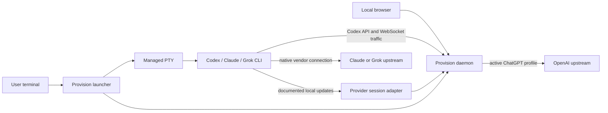

# Provision concepts

Provision keeps the native coding CLI as the primary interaction surface and
adds a local control plane around it. The default provider is Codex; other
supported CLIs retain their own authentication and upstream connection.

## The main pieces

- **Launcher:** chooses a provider, starts the daemon when needed, preserves
  normal CLI arguments, and manages a PTY for interactive sessions.
- **Daemon:** maintains local session state, serves the dashboard, and proxies
  Codex traffic through the selected ChatGPT profile.
- **Profile:** a named Codex credential set or a provider-native profile root.
  Codex profiles participate in account routing and quota reads; native provider
  profiles do not give Provision their credentials.
- **Session pin:** keeps a Codex workspace associated with a profile while other
  unpinned work uses the current active profile.
- **Discussion:** a bounded projection of observed turns, tools, and native
  history. It complements the terminal; it does not replace the provider's
  canonical transcript.
- **Connector ABI:** an experimental same-user, local socket contract that lets
  trusted connector processes carry bounded named frames over a transport they
  supply. It does not itself provide a listener, relay, or encryption.

## Trust boundaries

The browser receives a process-local dashboard session cookie. The durable
proxy capability is restricted to trusted CLI and launcher calls. Provision's
default daemon bind is loopback, and widening it requires explicit operator
consent because the daemon is not a multi-user authorization boundary.

Codex credentials are stored under `~/.provision/codex/profiles`. Claude and
Grok credentials remain in their vendor-owned profile roots and network paths.
See [SECURITY.md](../SECURITY.md) before integrating a transport or reverse
proxy.
